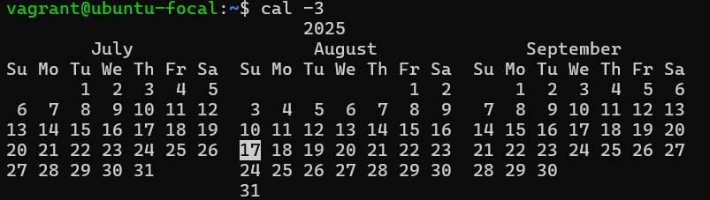

# Exercise 2: Exploring Linux Commands
As part of this exercise, I researched and tested 10 lesser-known Linux commands on an Ubuntu 20.04 LTS virtual machine. Each command was executed in the terminal, and its output was reviewed to understand its purpose and practical use. Screenshots of each command in action were captured from the VM and are included in the `images/` directory.

---

## 10 Linux Commands

### 1. `cal -3` (Three-Month Calendar)
The `cal -3` terminal command shows the previous, current, and next months side by side, making it easy to reference nearby dates and plan across multiple months. For example, running it in August 2025 displays July, August, and September. It is a handy tool available on Linux and macOS systems.  

---

### 2. `pv` (Pipe Viewer)
The `pv` command lets you monitor the progress of data through a pipeline. It shows a progress bar, time elapsed, and data rate, making it useful when copying large files or streaming data.  

---

### 3. `ncdu` (NCurses Disk Usage)
`ncdu` is a disk usage analyzer with a text-based interface. It helps you identify which directories or files are consuming the most space, making cleanup easier.  

---

### 4. `watch` (Re-run Commands Periodically)
The `watch` command runs a specified command repeatedly at regular intervals and displays the output. It's useful for monitoring changes in system status, such as disk usage or network activity.  

---

### 5. `lsof` (List Open Files)
`lsof` shows all open files and the processes using them. It is invaluable for diagnosing issues like locked files, active ports, or resource leaks.  

---

### 6. `mtr` (My Traceroute)
`mtr` combines the functionality of `ping` and `traceroute` to provide real-time network diagnostics. It shows the path packets take to a host and the latency at each hop, helping troubleshoot connectivity issues.  

---

### 7. `nl` (Number Lines)
The `nl` command numbers the lines of a file or input stream. It is useful for debugging scripts, reviewing logs, or adding line references to documentation.  

---

### 8. `strace` (System Call Tracer)
`strace` traces system calls and signals used by a process. It is a powerful debugging tool for developers and sysadmins to understand how a program interacts with the operating system.  

---

### 9. `pgrep` (Process Grep)
The `pgrep` command searches for processes by name and returns their process IDs. It’s a quick way to locate running services or scripts without parsing `ps` output manually.  

---

### 10. `tac` (Reverse Cat)
`tac` is like `cat`, but it displays file contents in reverse order—from the last line to the first. It is useful for reading logs or outputs where the latest entries are at the bottom.  

---

## Summary
These Linux commands offer powerful capabilities for system monitoring, debugging, file management, and automation. While they may not be part of everyday usage for beginners, they become essential tools as one dive deeper into Linux administration and scripting.
