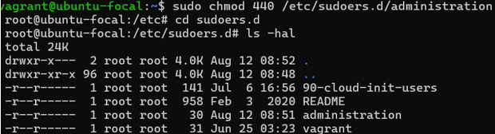

# Exercise 3: Linux User and Group Management

In this exercise, I practiced essential Linux system administration tasks by managing users, groups, and permissions. A summary of the steps I completed are as follows:

- Created three user groups: `administration`, `support`, and `engineering`.
- Added the `administration` group to the `sudoers` file, granting administrative privileges to its members.
- Created one user for each group and assigned them accordingly.
- Generated SSH keys for the user (useradmin) in the `administration` group to enable secure remote access.

These tasks were performed on an Ubuntu 20.04 LTS virtual machine.

---

## System Configuration Snapshots

Below are visual evidence placeholders showing the updated system configuration files after completing the exercise:

### `/etc/passwd`
This screenshot lists the added system users (useradmin, usersupport and userengineering) and their basic account details.

---

### `/etc/group`
This screenshot shows the created groups (administration, support and engineering) as well as their respective users (useradmin, usersupport and userengineering) on the system.

---

### `/etc/sudoers`
This screenshot depict `administration` has sudo privileges.

---

## Summary

Managing users and groups is a foundational skill for any Linux administrator. By completing this exercise, I have learned how to:

- Organize users into functional roles using groups
- Grant elevated privileges securely via the `sudoers` file
- Enable secure access using SSH key authentication

These practices are critical for maintaining a secure, scalable, and well-organized Linux environment in cloud infrastructure.

---
